# SecScanC2

[English](README.md)

SecScanC2可以创建P2P网络进行安全扫描和C2。该工具可以帮助安全研究人员更有效地进行渗透测试，防止扫描被封禁，保护自己免受溯源。

## 特性

- **P2P**：将大量互联网节点构建成P2P网络
- **防止扫描被封禁**：随机或指定节点作为代理池，P2P网络中的所有节点都将启动SOCKS代理，代理将被放入代理池。当我们进行检测和扫描时，我们可以连接到代理池，代理池会为每个请求随机选择代理。
- **可以有效隐藏C2服务器以防止被溯源**：去中心化结构，采用发布订阅的模式来完成各节点的信息交互。C2节点向P2P网络中发布命令，命令在网络中随机选择节点多跳传输，目标节点订阅到命令后，执行命令，并将命令执行结果发布到P2P网络中，执行结果随机选择节点多跳传输，C2节点最终订阅到命令执行结果。整个过程，C2节点不直接与目标节点交互，可避免被溯源。

## 使用说明

### 角色

**SecScanC2有两种角色：**

**admin**：渗透测试人员使用的管理节点

**node**：部署的普通节点

SecScanC2_admin：创建一个admin节点

SecScanC2_ node：创建一个node节点

两个程序的启动参数相同。


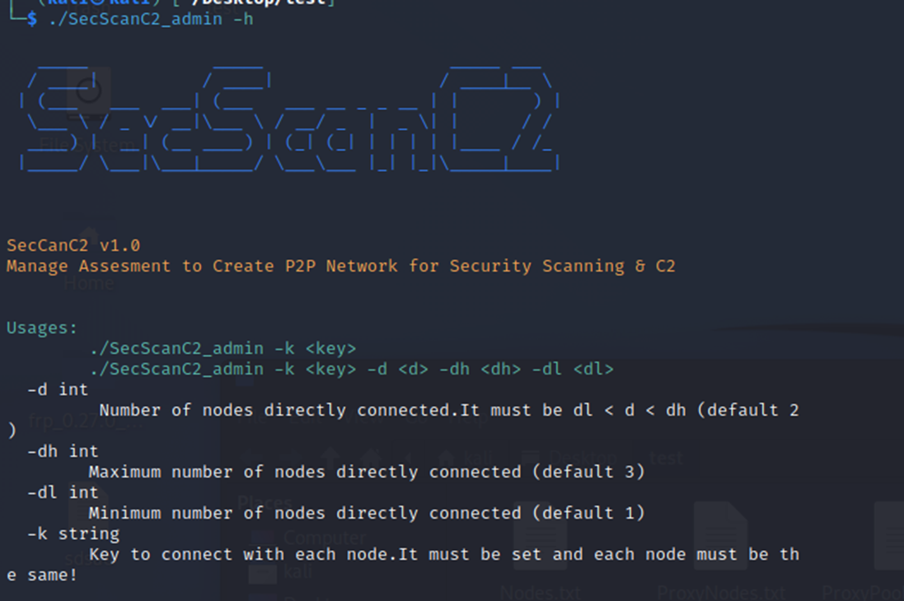


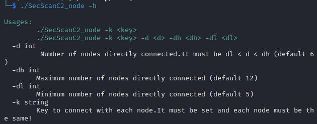


### 参数使用

```
Usages:
        ./SecScanC2_admin -k <key>
        ./SecScanC2_admin -k <key> -d <d> -dh <dh> -dl <dl>
  -d int
         Number of nodes directly connected.It must be dl < d < dh (default 2)
  -dh int
        Maximum number of nodes directly connected (default 3)
  -dl int
        Minimum number of nodes directly connected (default 1)
  -k string
        Key to connect with each node.It must be set and each node must be the same!
```

### 参数分析

**k：必填的**。用于连接每个节点的密钥，必须设置，并且每个节点**必须相同**！

**d**：可选。直接连接的节点数。必须是dl<d<dh。为了减少暴露，最好减少admin节点的直接连接。admin的默认值d为2。为了增加溯源的难度，普通节点的连接数最好大一些，普通节点的d默认值为6

**dh**：可选。直接连接的最大节点数。如果可连接节点数大于dh，将从网格中选择一些进行修剪，去除一些连接节点。保证最多可连接dh个节点。

**dl**：可选。直接连接的最小节点数。如果可连接节点数少于dl，将尝试将更多的节点移植到网格中，保证最少有dl个节点可连接。

### 功能介绍


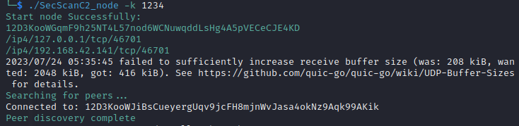

当普通节点出现“Peer discovery complete”信息时，证明该节点已成功启动并连接到P2P网络。


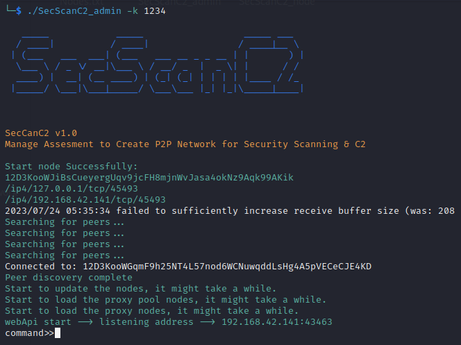

当admin节点出现上述信息时，证明admin已经成功启动并形成了P2P网络。admin将做一些初始化工作，包括更新节点、加载代理池节点、加载代理节点和启动web api服务器。可以在当前目录看到生成的节点信息文件。

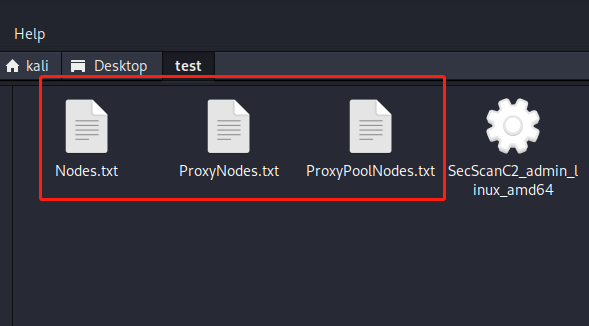


在admin控制台中，用户可以使用如下命令。用户可以输入h查看所有选项

```
Options:
        h                                          show help information
        list node                                  list all nodes
        update node                                update all nodes
        start proxy pool                           start proxy pool nodes
        list proxy pool                            list all proxy pool nodes
        update proxy pool                          update proxy pool nodes
        start proxy                                start proxy nodes
        list proxy                                 list all proxy nodes
        update proxy                               update proxy nodes
        shell                                      execute system commands on given node
        exit                                       exit SecScanC2
```


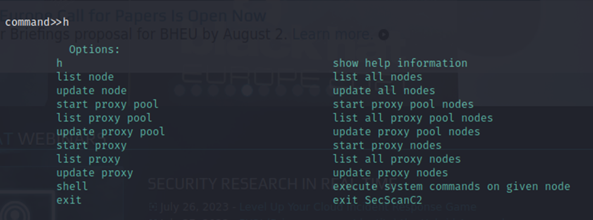


**list node, update node, start proxy, list proxy**

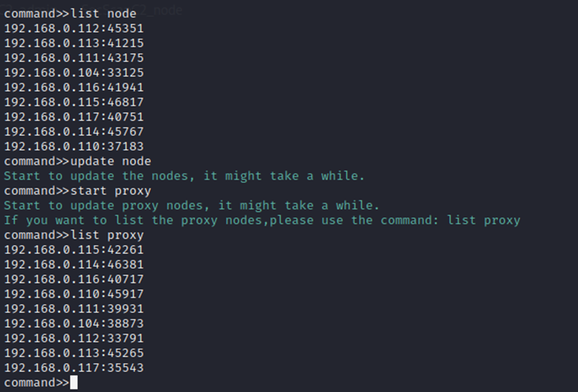


**start proxy pool**

P2P网络中的所有节点都可以启动一个socks代理。用户可以选择几个节点作为代理池。代理池每次收到请求时，都会随机选择一个socks代理。

用户可以选择代理池中的节点数量，选择是随机选择节点还是指定节点。如果选择“随机”，系统将随机选择用户指定的节点数来生成代理池。如果选择不随机，则用户需要输入指定数量的IP地址，系统将在指定IP的节点上生成代理池。用户可以使用命令list proxy pool、list proxy来获取所有代理池和代理节点的信息。

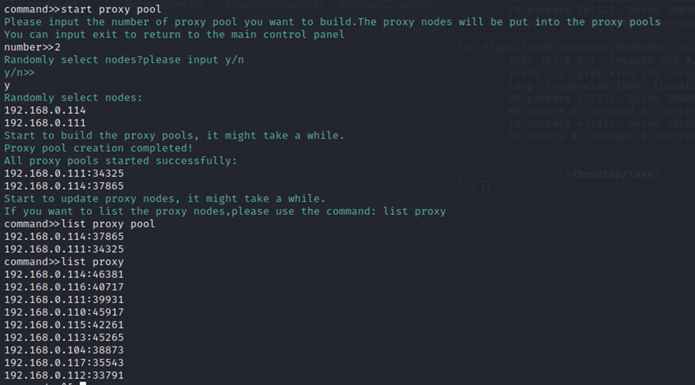


我们在做扫描时，可以将本地的SOCKS代理地址设置为代理池节点的监听地址。从代理池节点的日志中可以看到，每次请求都会随机选择一个代理节点。

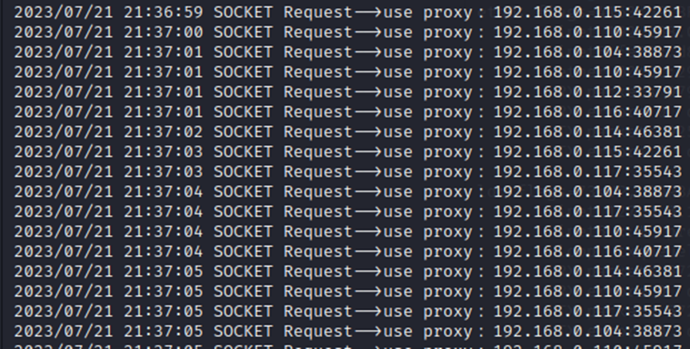


**shell**

用户可以指定任意受控节点来执行命令，需要输入IP和命令。

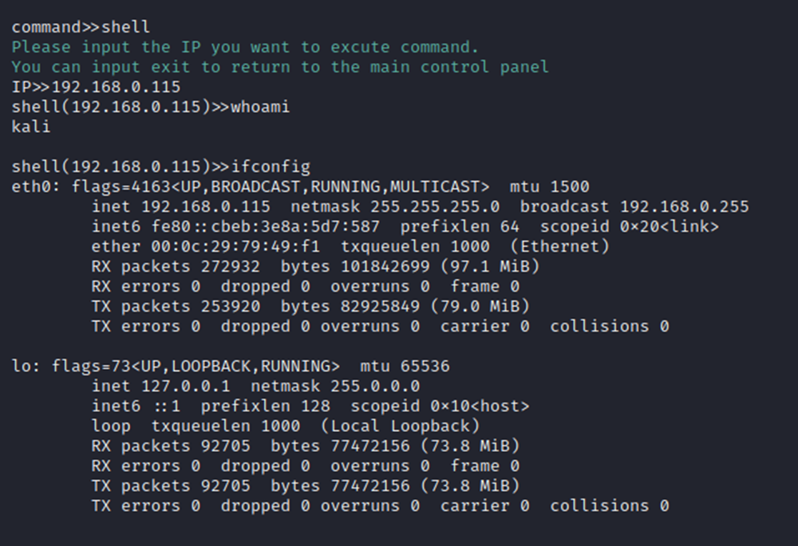


**Web API**

为了支持团队作战，所有操作都可以由web API调用。支持多用户同时远程操作。当然，出于安全原因，每个调用都要认证，需要用参数k来标识，k是启动admin节点时输入的值。

可以在admin的启动信息中找到web API的调用地址。

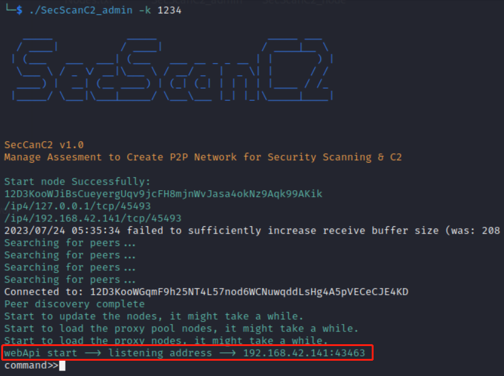


主页列出了所有API的路径和介绍

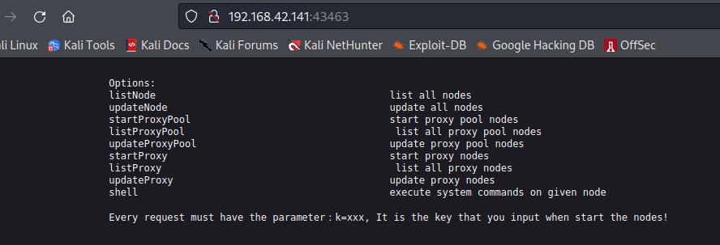


API调用地址：

	/listNode?k=xxx
	/updateNode?k=xxx
	/startProxyPool?k=xxx&random=y&number=2
	/startProxyPool?k=xxx&random=n&number=2&ip=192.168.0.1_192.168.0.2
	/listProxyPool?k=xxx
	/updateProxyPool?k=xxx
	/startProxy?k=xxx
	/listProxy?k=xxx
	/updateProxy?k=xxx
	/shell?k=xxx&ip=x.x.x.x&cmd=xxx

例如：

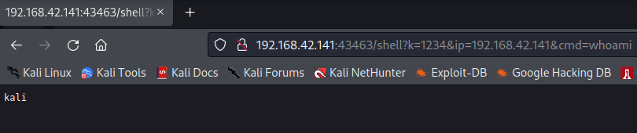

## 参考

https://github.com/libp2p/go-libp2p

https://github.com/libp2p/go-libp2p-pubsub

https://github.com/libp2p/go-libp2p-kad-dht

https://github.com/pingc0y/go_proxy_pool

https://github.com/armon/go-socks5